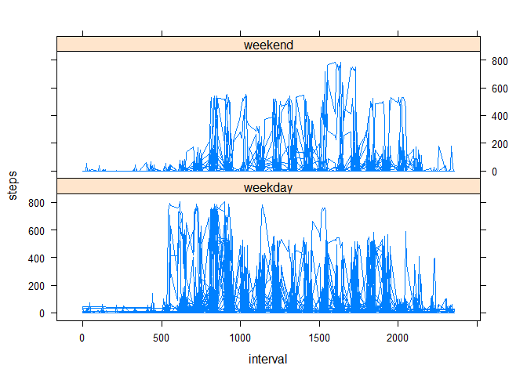

# Reproducible Research: Peer Assessment 1


## Loading and preprocessing the data

```r
if (!file.exists("activity.csv")) { unzip("repdata_data_activity.zip") }
data <- read.csv("activity.csv")
data$date <- as.Date(data$date)
data$day <- as.character(weekdays(data$date)) %in% c("dimanche","samedi")
data$day <- as.factor(data$day)
levels(data$day)<-c("weekday","weekend")
```


## What is mean total number of steps taken per day?

```r
# Load Dplyr library without Welcome message
suppressMessages(library(dplyr))
# We calculate the total, mean and media, number of steps taken per day
dataDay  <- data %>% group_by(date) %>% summarize(sum = sum(steps),mean=mean(steps),median=steps[144]) 
barplot(dataDay$sum,col="blue",main="Histogram of total number of steps per day",ylab="Number of steps", xlab="Period : October - November, 2012")
```

 

```r
#Here we calculate mean and median of the total number of steps taken per day
dataDay
```

```
## Source: local data frame [61 x 4]
## 
##          date   sum     mean median
## 1  2012-10-01    NA       NA     NA
## 2  2012-10-02   126  0.43750      0
## 3  2012-10-03 11352 39.41667    116
## 4  2012-10-04 12116 42.06944      0
## 5  2012-10-05 13294 46.15972      0
## 6  2012-10-06 15420 53.54167     72
## 7  2012-10-07 11015 38.24653     34
## 8  2012-10-08    NA       NA     NA
## 9  2012-10-09 12811 44.48264     38
## 10 2012-10-10  9900 34.37500     88
## ..        ...   ...      ...    ...
```


## What is the average daily activity pattern?


```r
dataInterval  <- data %>% group_by(interval) %>% summarize(mean=mean(steps,na.rm=TRUE))
with(dataInterval, plot(interval, mean, main = "Steps in each 5 min interval", type = "l", col="red")) 
```

 

```r
dataInterval[dataInterval$mean==max(dataInterval$mean), ]
```

```
## Source: local data frame [1 x 2]
## 
##   interval     mean
## 1      835 206.1698
```

## Imputing missing values

```r
# Number of NA values
count(data[is.na(data$steps)==TRUE,])
```

```
## Source: local data frame [1 x 1]
## 
##      n
## 1 2304
```

```r
intervals <- unique(data$interval)
dataFill <- data.frame(steps=integer(),
                       date=factor(),
                       interval=integer())
for (i in intervals) {
  dataFill <- rbind(dataFill, filter (data,interval==i) %>%
            mutate(mean=mean(steps,na.rm=TRUE)))
}
dataNA <- filter(dataFill, is.na(steps)) %>% mutate(steps=mean)
dataNew <- rbind(filter(dataFill, !is.na(steps)), dataNA)
dataDay  <- dataNew %>% group_by(date) %>% 
  summarize(sum = sum(steps),mean=mean(steps),median=round(steps[144])) 
barplot(dataDay$sum,col="blue",main="Histogram of total number of steps per  day without NA values",ylab="Number of steps", xlab="Period : October - November, 2012")
```

 

```r
#Here we calculate mean and median of the total number of steps taken per day
dataDay
```

```
## Source: local data frame [61 x 4]
## 
##          date      sum     mean median
## 1  2012-10-01 10766.19 37.38260     59
## 2  2012-10-02   126.00  0.43750      0
## 3  2012-10-03 11352.00 39.41667    116
## 4  2012-10-04 12116.00 42.06944      0
## 5  2012-10-05 13294.00 46.15972      0
## 6  2012-10-06 15420.00 53.54167     72
## 7  2012-10-07 11015.00 38.24653     34
## 8  2012-10-08 10766.19 37.38260     59
## 9  2012-10-09 12811.00 44.48264     38
## 10 2012-10-10  9900.00 34.37500     88
## ..        ...      ...      ...    ...
```

Now we don't have day with NA value for mean or median. We supress some gap in the histogram

## Are there differences in activity patterns between weekdays and weekends?

```r
dataWeekend  <- data %>% filter(day=="weekend") %>% group_by(interval) %>% summarize(mean=mean(steps,na.rm=TRUE))
dataWeeday  <- data %>% filter(day!="weekend") %>% group_by(interval) %>% summarize(mean=mean(steps,na.rm=TRUE))
with(dataWeekend, plot(interval, mean, main = "Steps in each 5 min interval", type = "n")) 
with(dataWeekend, line(interval, mean), col="blue") 
```

```
## 
## Call:
## line(interval, mean)
## 
## Coefficients:
## [1]  -1.05368   0.02833
```

```r
with(dataWeeday, line(interval, mean), col="red") 
```

```
## 
## Call:
## line(interval, mean)
## 
## Coefficients:
## [1]  8.52875  0.01126
```

```r
legend("topright", pch = 1, col = c("blue", "red"), legend = c("Weekend", "Weekday"))
```

 
